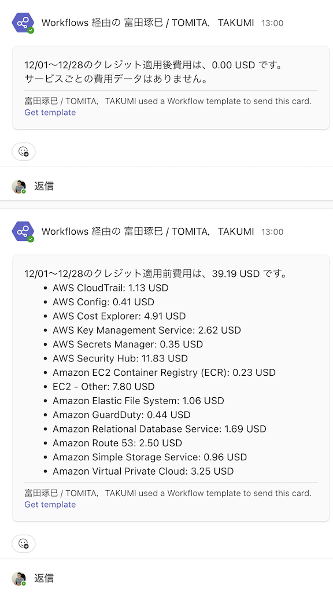

# aws-cost-explore
このリポジトリは、AWS の Cost Explorer を利用して**指定期間の費用・使用状況を取得し、レポートを生成**する Python スクリプトです。  
標準出力および Microsoft Teams Webhook への通知にも対応しています。

## 概要

本スクリプトは以下のようなフローを想定しています:

1. **AWS Cost Explorer** から今月分のコストを取得  
2. クレジット適用前と適用後の費用を計算  
3. サービスごとの費用内訳を整形  
4. **標準出力** と、必要に応じて **Microsoft Teams** (Webhook) へレポート送信  

これにより、AWSコストを手軽に可視化・共有し、不要なコストの早期発見や管理に役立てることができます。

## 前提
- [uv](https://docs.astral.sh/uv/) がインストールされていること
- [AWS CLI v2](https://docs.aws.amazon.com/cli/latest/userguide/getting-started-install.html) と **IAM Identity Center**（旧 AWS SSO）によるサインインが使えること
- （オプション）Microsoft Teams への通知を行う場合は、Webhook URL を **AWS Secrets Manager** に登録しておくこと（手順は後述）

## セットアップ

1. **リポジトリのクローン**

   ```bash
   git clone https://github.com/<your-org>/<this-repo>.git
   cd this-repo
   ```

2. **IAM Identity Center（SSO）のプロファイルを作成**

   初回のみ、対話形式で SSO を設定します（組織の SSO 開始 URL・リージョン・アカウント・ロールは管理者から案内された値を使ってください）。

   ```bash
   aws configure sso
   ```

   完了すると `~/.aws/config` に `[profile 名前]` が追加されます。

3. **SSO でログイン**

   セッションが切れるたび、または初回実行前に:

   ```bash
   aws sso login --profile <your-sso-profile>
   ```

4. **依存パッケージをインストール**

   ```bash
   uv sync
   ```
   - `boto3`, `requests`, `pytest` などがインストールされます。
   - 仮想環境 (`.venv`) の作成も自動で行われます。

## 使い方

### 環境変数の設定

認証は **長期アクセスキーをリポジトリに置かず**、[IAM Identity Center のプロファイル](https://docs.aws.amazon.com/cli/latest/userguide/sso-configure-profile-token.html)を使います。`aws sso login` で取得した短期資格情報は `~/.aws` 配下にキャッシュされ、boto3 が `AWS_PROFILE` 経由で利用します。

**このプロジェクトは `.env` を読みません。** 次の **`export` ブロックをターミナルにコピペし、値だけ自分の環境に合わせて書き換えてから** `uv run` してください（`uv run` は子プロセスになるため、**必ず `export` 済み**にする必要があります）。

永続化したい場合は、同じ内容を `~/.zshrc` に貼るか、[direnv](https://direnv.net/) の `.envrc` で `export` してください。

#### コピペ用テンプレート（ローカル）

```bash
# --- AWS（必須）---
export AWS_PROFILE=my-company-sso
export AWS_DEFAULT_REGION=ap-northeast-1
export AWS_PAGER=

# --- Teams（使うときだけ # を外して値を埋める）---
# export USE_TEAMS_POST=yes
# export TEAMS_WEBHOOK_URL="https://<your-domain>/workflows/<your-webhook-url>"

# Webhook の代わりに Secrets Manager を使うローカル検証:
# export USE_TEAMS_POST=yes
# export TEAMS_SECRET_ARN=arn:aws:secretsmanager:ap-northeast-1:<account-id>:secret:teams-webhook-url-xxxxxx

# 常に text のみ送りたいとき（省略可）:
# export TEAMS_WEBHOOK_FORMAT=text
```

変数の意味:

- **AWS_PROFILE** — `aws configure sso` で作った名前（`~/.aws/config` の `[profile xxx]` と一致）。設定すると `aws` / `sam` / boto3 が **`--profile` なし**で動く。
- **AWS_DEFAULT_REGION**（または **AWS_REGION**）— 利用リージョン。
- **AWS_PAGER** — 空にすると AWS CLI の **ページャ（less）** を止められる。
- **USE_TEAMS_POST** — `yes` のときだけ Teams に POST する。
- **TEAMS_WEBHOOK_URL** — ローカルではここを優先。Lambda では SAM が **TEAMS_SECRET_ARN** 経由で Secrets を渡す想定。
- **TEAMS_SECRET_ARN** — `TEAMS_WEBHOOK_URL` が無いとき、Secrets Manager から Webhook URL を取得する。
- **TEAMS_WEBHOOK_FORMAT** — 未設定なら Adaptive（旧 Incoming Webhook 互換）を試し、失敗時は `{"text":...}` にフォールバック。

`AWS_PROFILE` があれば **`aws sso login` も `--profile` なし**でよいです。

Teams は任意です。Lambda では SAM が **TEAMS_SECRET_ARN** を渡すため、初回だけ例えば次でシークレットを作成します（手元で `export TEAMS_SECRET_ARN=...` するときも同じ URL を格納します）。

```bash
aws secretsmanager create-secret \
  --name teams-webhook-url \
  --secret-string "https://<your-domain>/workflows/<your-webhook-url>"
```

シークレット値が JSON（例: `{"url":"https://..."}`）でも、コード側で URL を取り出します。

#### Teams に届かないとき

- **`export` したシェルで `uv run` しているか**確認してください（別ターミナルや IDE から実行すると環境変数が空のままです）。

- **Webhook の種類で挙動が違います。**
  - **クラシック「Incoming Webhook」（チャネルコネクタ）**  
    POST が成功すると、**そのチャネルに直接**メッセージが載る想定です。
  - **Teams の「ワークフロー」→ Power Automate の「Webhook の要求を受け取ったとき」**  
    POST が **HTTP 200/202 で成功**しても、それは **「フローのトリガーが受信した」**だけです。**チャネルに出すには、トリガーのあとに別アクションが必須**です。アプリ側のログが成功でも、Teams に何も出ないのはこのパターンが典型です。

- **Power Automate でチャネルに出したい場合（最低限の構成）**
  1. トリガー: **Microsoft Teams — Webhook の要求を受け取ったとき**（発行した URL を本アプリの `TEAMS_WEBHOOK_URL` に設定）。
  2. その直後にアクション: **Microsoft Teams — チャットまたはチャネルにメッセージを投稿する**（または同等の投稿アクション）。
  3. メッセージ本文に、トリガーで受け取った本文の **`text`** を指定する。  
     動的なコンテンツに `text` が出てこない場合は、式の例: `triggerOutputs()?['body']?['text']`（環境によってキー名が違うときは「実行履歴」で受信 JSON を確認）。
  4. Power Automate の **実行履歴**で、トリガーが緑になっているか、投稿アクションでエラーになっていないかを確認。

- ログの **`Teams Webhook へ HTTP 202` かつ応答本文 `(空)`** は、Workflow 受信成功でよくある組み合わせです。**表示はフロー側の「投稿」ステップ**で決まります。
- ログに `Teams Webhook（形式: adaptive）が失敗` のあと `形式: text` で成功、と出ていれば **HTTP 的には text ペイロードは通っています**。

### 実行例

上の **コピペ用テンプレート**で `export` を済ませたうえで:

```bash
aws sso login   # AWS_PROFILE が効いていれば --profile 不要
uv run python sam/app/app.py
```

Teams を有効にしている場合も同じ（テンプレートの Teams 行の `#` を外してから実行）。

実行後は、標準出力に以下のようなレポートが表示されます。
`USE_TEAMS_POST=yes` なら同一内容が Teams にも投稿されます。

```
takumi@iMac aws-cost-explore % uv run python sam/app/app.py
------------------------------------------------------
12/01～12/28のクレジット適用後費用は、0.00 USD です。
サービスごとの費用データはありません。
------------------------------------------------------

------------------------------------------------------
12/01～12/28のクレジット適用前費用は、39.19 USD です。
- AWS CloudTrail: 1.13 USD
- AWS Config: 0.41 USD
- AWS Cost Explorer: 4.91 USD
- AWS Key Management Service: 2.62 USD
- AWS Secrets Manager: 0.35 USD
- AWS Security Hub: 11.83 USD
- Amazon EC2 Container Registry (ECR): 0.23 USD
- EC2 - Other: 7.80 USD
- Amazon Elastic File System: 1.06 USD
- Amazon GuardDuty: 0.44 USD
- Amazon Relational Database Service: 1.69 USD
- Amazon Route 53: 2.50 USD
- Amazon Simple Storage Service: 0.96 USD
- Amazon Virtual Private Cloud: 3.25 USD
------------------------------------------------------
```



### Lambda へのデプロイ（AWS SAM）

リポジトリの `sam/` でビルドしてデプロイします。Teams 通知を使う場合は、デプロイ前に Secrets Manager へ Webhook URL を登録してください。

**Teams を使う場合（初回のみ: シークレット作成）**

```bash
# 1. Secrets Manager にシークレットを作成
aws secretsmanager create-secret \
  --name teams-webhook-url \
  --secret-string "https://<your-domain>/workflows/<your-webhook-url>"

# 2. ARN を確認
aws secretsmanager describe-secret \
  --secret-id teams-webhook-url \
  --query ARN --output text
```

**ビルド＆デプロイ**

```bash
cd sam
sam build
sam deploy \
  --parameter-overrides \
    UseTeamsPost=yes \
    TeamsWebhookSecretArn=arn:aws:secretsmanager:<region>:<account-id>:secret:teams-webhook-url-xxxxxx
```

Teams を使わない場合の例:

```bash
sam deploy --parameter-overrides UseTeamsPost=no
```

`TeamsWebhookSecretArn` は `UseTeamsPost=no` の場合は省略可能です（テンプレートのデフォルトは空文字です）。

## ライセンス

このプロジェクトは [MIT License](./LICENSE) のもとで公開されています。  
詳細は [LICENSE](./LICENSE) ファイルを参照してください。